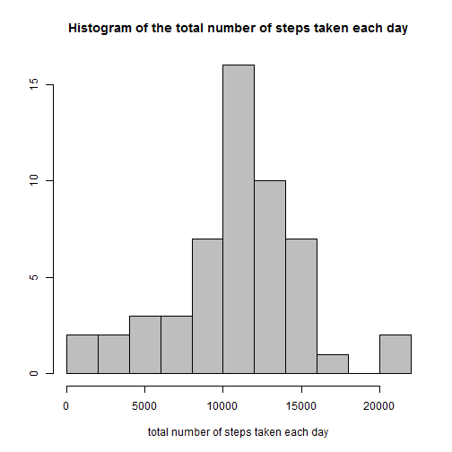
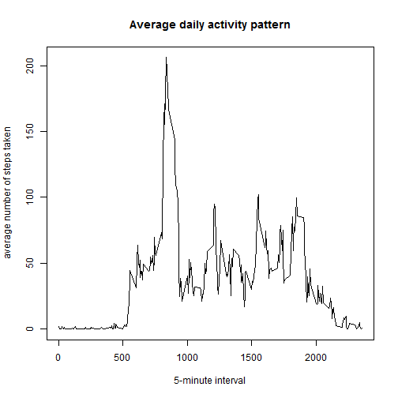
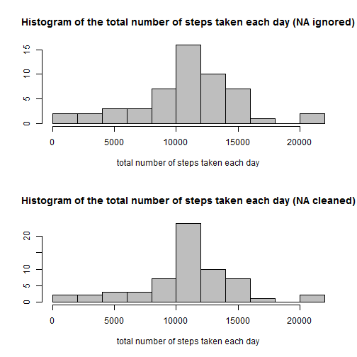
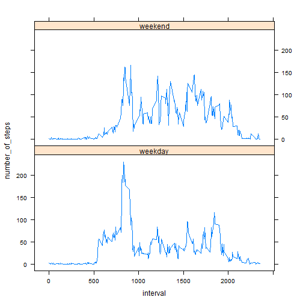

# Reproducible Research: Peer Assessment 1
========================================================

## Loading and preprocessing the data

```r
data <- read.csv("activity.csv", sep = ",", stringsAsFactor = F, header = TRUE)
data$date <- as.Date(data$date, format = "%Y-%m-%d")
```


## What is mean total number of steps taken per day?

```r
library(sqldf)
data1 <- data[which(data$steps != "NA"), ]
data1sum <- sqldf("select data1.date, sum(data1.steps) as totsteps from data1 group by data1.date")
hist(data1sum$totsteps, col = "gray", main = "Histogram of the total number of steps taken each day", 
    ylab = "", xlab = "total number of steps taken each day", breaks = 9)
```

 

```r
x <- mean(data1sum$totsteps)
y <- median(data1sum$totsteps)
```

The mean total number of steps taken per day is 1.0766 &times; 10<sup>4</sup>.
The median total number of steps taken per day is 10765.

## What is the average daily activity pattern?

```r
data2ave <- sqldf("select data1.interval, avg(data1.steps) as avgsteps from data1 group by data1.interval")
plot(data2ave$interval, data2ave$avgsteps, type = "l", ylab = "average number of steps taken", 
    xlab = "5-minute interval", main = "Average daily activity pattern")
```

 

```r
data2max <- data2ave[order(-data2ave$avgsteps), ]
z <- data2max[1, 2]
```

206.1698 is 5-minute interval, on average across all the days in the dataset, contains the maximum number of steps.

## Imputing missing values

```r
n <- nrow(data) - nrow(data1)
```


The total number of missing values in the dataset is 2304.  
The strategy for filling in all of the missing values in the dataset is the mean for that 5-minute interval.  
Create a new dataset that is equal to the original dataset but with the missing data filled in:

```r
data3 <- sqldf("select data.*, data2ave.avgsteps from data left outer join data2ave on data.interval=data2ave.interval")
data3$stepcln <- ifelse(data3$steps %in% (NA), data3$avgsteps, data3$steps)
datacln <- data3[, c("date", "interval", "stepcln")]
data2sum <- sqldf("select datacln.date, sum(datacln.stepcln) as totsteps from datacln group by datacln.date")
par(mfrow = c(2, 1))
hist(data1sum$totsteps, col = "gray", main = "Histogram of the total number of steps taken each day (NA ignored)", 
    ylab = "", xlab = "total number of steps taken each day", breaks = 9)
hist(data2sum$totsteps, col = "gray", main = "Histogram of the total number of steps taken each day (NA cleaned)", 
    ylab = "", xlab = "total number of steps taken each day", breaks = 9)
```

 

```r
x2 <- mean(data2sum$totsteps)
y2 <- median(data2sum$totsteps)
```

The mean total number of steps taken per day is 1.0766 &times; 10<sup>4</sup>.  
The median total number of steps taken per day is 1.0766 &times; 10<sup>4</sup>.

## Are there differences in activity patterns between weekdays and weekends?


```r
datacln$weekd <- weekdays(datacln$date)
datacln$weekd <- ifelse(datacln$weekd %in% ("суббота") | datacln$weekd %in% 
    ("воскресенье"), "weekend", "weekday")
datawd <- sqldf("select datacln.weekd, datacln.interval, avg(datacln.stepcln) as number_of_steps from datacln group by datacln.weekd, datacln.interval")
datawd$weekd <- as.factor(datawd$weekd)
library(lattice)
p <- xyplot(number_of_steps ~ interval | weekd, datawd, layout = c(1, 2), type = "l")
print(p)
```

 

